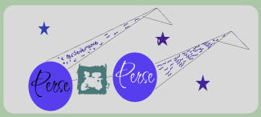

## Inspiration
The inspiration behind "Perse" stems from a desire to enhance the educational experience using innovative technologies. The goal is to leverage the power of Artificial Intelligence (AI) to address challenges within the education sector. Recognizing the transformative impact of large language models (LLMs) and AI, the aim is to create a tool that supports teachers and students, focusing on aspects like curriculum planning, question selection, teacher training, content generation, personalized feedback, and automated grading.

## What it does
"Perse" is a Flask web application that integrates educational AI, space photos, and fun facts, all powered by Redis for efficient data storage and retrieval. The application offers a dynamic and engaging user experience, featuring educational AI content tailored to user interests. Users can explore space-related photos, discover fun facts, and even receive personalized feedback based on their interactions with the platform.

Key Features:

Educational AI Module: Delivers insightful content on topics related to Mars rovers, exploration missions, and technological advancements in space exploration.
Space Photos: Showcases random space-related photos, providing users with visually captivating content.
Fun Facts: Presents interesting and educational fun facts about space, Mars rovers, and related topics.
AutoScraper Integration: Allows users to extract information from provided URLs, enhancing their ability to explore and learn from external sources.
Real-time Updates: Provides real-time updates through a WebSocket connection, fostering an interactive and dynamic user experience.
## How we built it
"Perse" is built using the Flask web framework, a powerful and lightweight tool for developing web applications in Python. The integration of Redis enhances data caching and retrieval efficiency. The application leverages the AutoScraper library for web scraping, enabling dynamic content extraction from external URLs.

Key Technologies Used:

Flask
Redis
AutoScraper
WebSocket for real-time updates
SendGrid for email communication
Transformers library for text summarization
Flask-Login for user authentication
Challenges we ran into
Building "Perse" posed various challenges, including:

Integration Complexity: Integrating multiple modules, such as educational AI, space photos, and AutoScraper, required meticulous coordination.
Real-time Updates: Implementing real-time updates through WebSocket posed challenges in ensuring seamless communication between the server and clients.
User Authentication: Developing a secure and user-friendly authentication system with Flask-Login presented complexities.
Accomplishments that we're proud of
Despite the challenges, "Perse" has achieved several accomplishments:

Robust Functionality: The application seamlessly combines diverse features, providing users with a comprehensive educational experience.
Real-time Interaction: Successfully implementing real-time updates enhances user engagement and keeps them informed instantly.
User Authentication: Establishing a secure user authentication system ensures personalized feedback and a tailored experience.
## What we learned
The development of "Perse" has been a learning journey:

Integration Skills: Gained expertise in integrating AI modules, web scraping tools, and real-time communication features.
User-Centric Design: Learned to prioritize user experience by incorporating personalized feedback and interactive elements.
## What's next for Perse
The future roadmap for "Perse" includes:

Enhanced User Profiles: Implementing user profiles to track individual progress and preferences.
Expanded Educational AI Content: Enriching the educational AI module with more diverse and in-depth topics.
Collaborative Features: Introducing collaborative elements, such as discussion forums or shared learning spaces.
Gamification: Incorporating gamified elements to incentivize and reward user engagement.
"Perse" aims to continually evolve, providing an ever-improving educational platform for users interested in space exploration and AI in education.